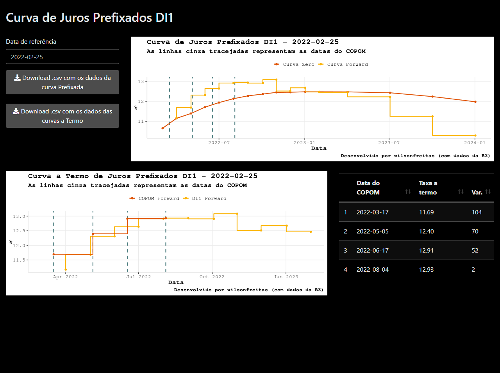

# Curva de Juros Prefixados

Aplicação shiny para visualização da curva de juros prefixados obtida dos contratos futuros de taxa DI negociados na B3.

O dashboard traz:

-   Curva a vista de juros prefixados
-   Curva a termo de juros prefixados
-   Curva a termos com interpolação nas datas do COPOM (nas 4 próximas)
-   As datas das reuniões do COPOM

Link para o dashboard: <https://wilsonfreitas.shinyapps.io/curvapre/>.

> Os dados são obtidos do site da B3 via *webscraping*, logo, *podem apresentar eventuais falhas*.
